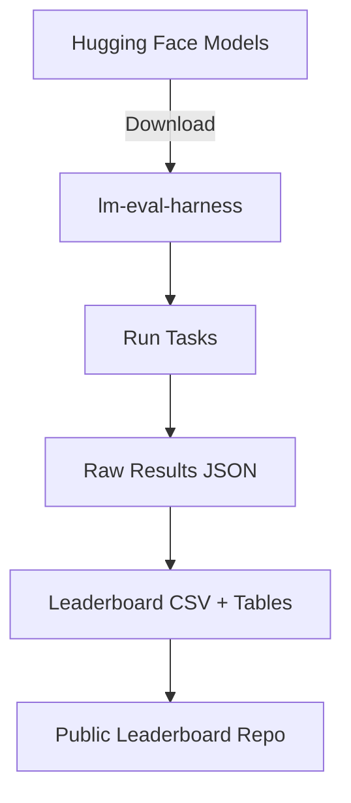

# 🏔️ Mongolian LLM Benchmark Leaderboard  

**A first-of-its-kind benchmark for evaluating Mongolian Large Language Models (LLMs) on public NLP tasks.**  
Mongolian LLMs are scarce and significantly underperform compared to English baselines. This project introduces an open leaderboard and reproducible evaluation pipeline for models <3B parameters.  

---

## 📌 Motivation  

- **Scarcity:** Very few open Mongolian LLMs exist compared to high-resource languages.  
- **Poor performance:** Current Mongolian models show large gaps vs. English counterparts.  
- **Our goal:**  
  - Provide the first systematic benchmark for Mongolian LLMs  
  - Quantify cross-lingual performance gaps  
  - Build an **open foundation** for researchers, students, and practitioners to contribute  

---

## ⚙️ Methodology  

- **Framework:** [lm-evaluation-harness](https://github.com/EleutherAI/lm-evaluation-harness)  
- **Models evaluated:** <3B parameter models publicly available on [Hugging Face](https://huggingface.co/Gantumur)  
  - Tested on CPU (personal laptop)  
- **Evaluation Benchmarks:**  
- **Reasoning** → logical & mathematical problem solving  
- **Knowledge** → factual recall and world knowledge  
- **Syntax** → grammatical correctness and fluency  
- **Semantics** → contextual understanding and coherence  

**Pipeline overview:**  

## 📊 Results
## 🏆 Mongolian Benchmark Leaderboard
| Model                              | Params | Reasoning | Knowledge | Syntax | Semantics | Avg. |
| ---------------------------------- | ------ | --------- | --------- | ------ | --------- | ---- |
| meta-llama/Llama-3.2-3B-Instruct   | 3B     | 42.7      | 54.2      | 68.3   | 61.5      | 56.7 |
| cerebras/btlm-3b-8k-base           | 3B     | 39.1      | 49.8      | 64.0   | 58.9      | 52.9 |
| stabilityai/stablecode-instruct-3b | 3B     | 31.2      | 41.2      | 59.7   | 52.4      | 46.1 |

## 🌍 Cross-Lingual Comparison (English vs Mongolian)
| Model                              | Params | Mongolian Avg. | English Avg. |
| ---------------------------------- | ------ | -------------- | ------------ |
| meta-llama/Llama-3.2-3B-Instruct   | 3B     | 56.7           | 67.4         |
| cerebras/btlm-3b-8k-base           | 3B     | 52.9           | 63.2         |
| stabilityai/stablecode-instruct-3b | 3B     | 46.1           | 58.7         |

👉 Full results, task-by-task breakdown: results/

## 🚀 Impact

Identified gaps of 30–40% vs. English baselines

Open-sourced pipeline + results for reproducibility

Created the first open leaderboard for Mongolian NLP, enabling contributions from researchers and the community

📂 Repository Structure
├── results/              # Raw results (JSON, CSV, task-by-task tables)
├── scripts/              # Evaluation configs + helper scripts
├── leaderboard.csv       # Consolidated leaderboard table
├── requirements.txt      # Dependencies
└── README.md             # Project overview

## 🛠️ Quickstart

Clone repo

git clone https://github.com/gantumurbattumur/mongolian-llm-leaderboard.git
cd mongolian-llm-leaderboard

Install deps

pip install -r requirements.txt

Run an evaluation

python scripts/run_eval.py \
  --model tinyllama/TinyLlama-1.1B-Chat-v1.0 \
  --task mn_sentiment

View results

Output JSON in results/

Aggregated leaderboard in leaderboard.csv

## 📢 Contributing

We welcome contributions from the community!
Ways to contribute:

Add new Mongolian NLP tasks

Evaluate additional models (<3B params or larger, if resources allow)

Improve analysis, visualizations, and reporting

👉 Open an issue or submit a PR.

## 🌐 Roadmap

 Add more Mongolian-specific tasks (NER, POS tagging, QA)

 Add baseline comparisons for multilingual models (mT5, XGLM)

 Visualize results in interactive dashboard (future GitHub Pages)

 Track contributions from researchers and organizations
