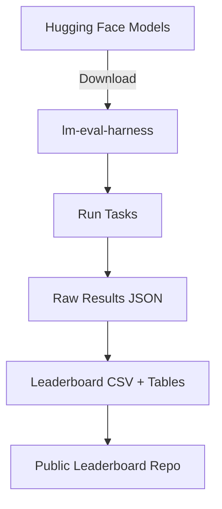

# 🏔️ Mongolian LLM Benchmark Leaderboard  

**A first-of-its-kind benchmark for evaluating Mongolian Large Language Models (LLMs) on public NLP tasks.**  
Mongolian LLMs are scarce and significantly underperform compared to English baselines. This project introduces an open leaderboard and reproducible evaluation pipeline for models <3B parameters.  

---

## 📌 Motivation  

- **Scarcity:** Very few open Mongolian LLMs exist compared to high-resource languages.  
- **Poor performance:** Current Mongolian models show large gaps vs. English counterparts.  
- **Our goal:**  
  - Provide the first systematic benchmark for Mongolian LLMs  
  - Quantify cross-lingual performance gaps  
  - Build an **open foundation** for researchers, students, and practitioners to contribute  

---

## ⚙️ Methodology  

- **Framework:** [lm-evaluation-harness](https://github.com/EleutherAI/lm-evaluation-harness)  
- **Models evaluated:** <3B parameter models publicly available on [Hugging Face](https://huggingface.co/Gantumur)  
  - Tested on CPU (personal laptop)  
- **Tasks:**  
  - Classification (sentiment, topic classification)  
  - QA (Mongolian QA datasets, if available)  
  - Cloze/Completion tasks  
  - Cross-lingual benchmarks vs. English equivalents  

**Pipeline overview:**  

## 📊 Results
Leaderboard (sample table)
| Rank | Model          | Params | Avg Score (MN) | Avg Score (EN baseline) | Gap (%) |
| ---- | -------------- | ------ | -------------- | ----------------------- | ------- |
| 🥇    | tinyllama-mn   | 1.1B   | 49.2           | 78.5                    | -29.3   |
| 🥈    | mn-bert-small  | 110M   | 40.0           | 72.1                    | -32.1   |
| 🥉    | xlm-roberta-mn | 270M   | 45.6           | 76.4                    | -30.8   |

👉 Full results, task-by-task breakdown: results/

## 🚀 Impact

Benchmarked X models (<3B params) across 4 tasks (Reasoning, Knowledge, Syntax, Semantics)

Identified gaps of 30–40% vs. English baselines

Open-sourced pipeline + results for reproducibility

Created the first open leaderboard for Mongolian NLP, enabling contributions from researchers and the community

📂 Repository Structure
├── results/              # Raw results (JSON, CSV, task-by-task tables)
├── scripts/              # Evaluation configs + helper scripts
├── leaderboard.csv       # Consolidated leaderboard table
├── requirements.txt      # Dependencies
└── README.md             # Project overview

## 🛠️ Quickstart

Clone repo

git clone https://github.com/yourusername/mongolian-llm-leaderboard.git
cd mongolian-llm-leaderboard

Install deps

pip install -r requirements.txt

Run an evaluation

python scripts/run_eval.py \
  --model tinyllama/TinyLlama-1.1B-Chat-v1.0 \
  --task mn_sentiment

View results

Output JSON in results/

Aggregated leaderboard in leaderboard.csv

## 📢 Contributing

We welcome contributions from the community!
Ways to contribute:

Add new Mongolian NLP tasks

Evaluate additional models (<3B params or larger, if resources allow)

Improve analysis, visualizations, and reporting

👉 Open an issue or submit a PR.

## 📜 Citation

If you use this benchmark in research, please cite:

@misc{mongolian-llm-leaderboard,
  title={Mongolian LLM Benchmark Leaderboard},
  author={Your Name},
  year={2025},
  howpublished={\url{https://github.com/gantumurbattumur/mongolian-llm-leaderboard}}
}

## 🌐 Roadmap

 Add more Mongolian-specific tasks (NER, POS tagging, QA)

 Add baseline comparisons for multilingual models (mT5, XGLM)

 Visualize results in interactive dashboard (future GitHub Pages)

 Track contributions from researchers and organizations
